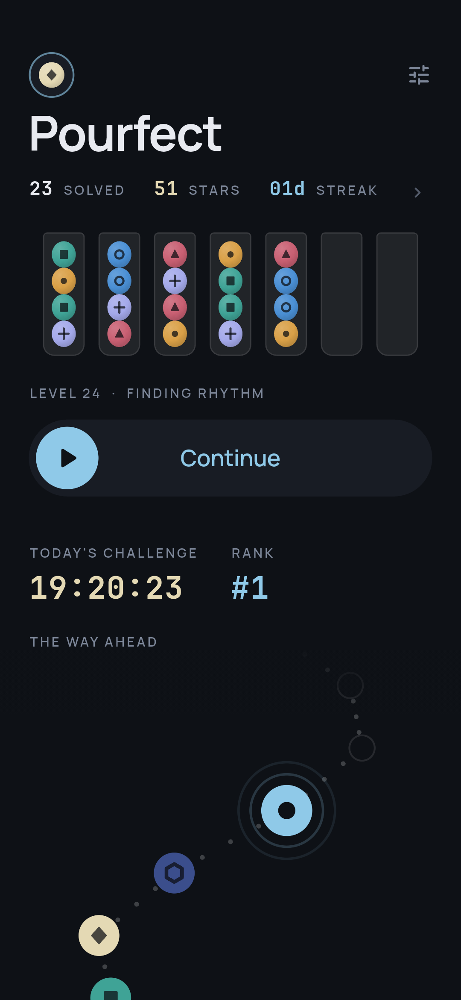
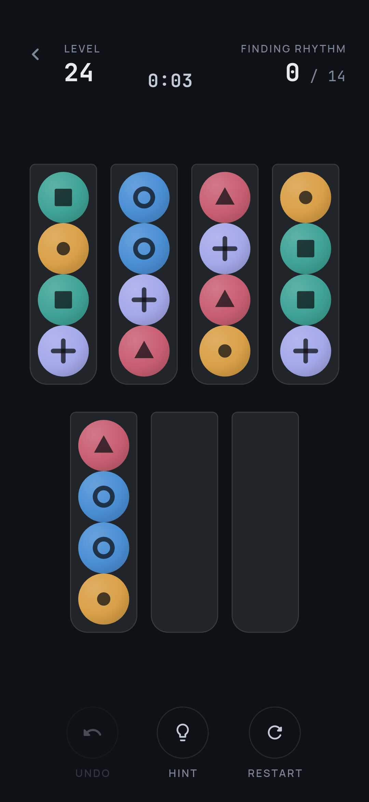
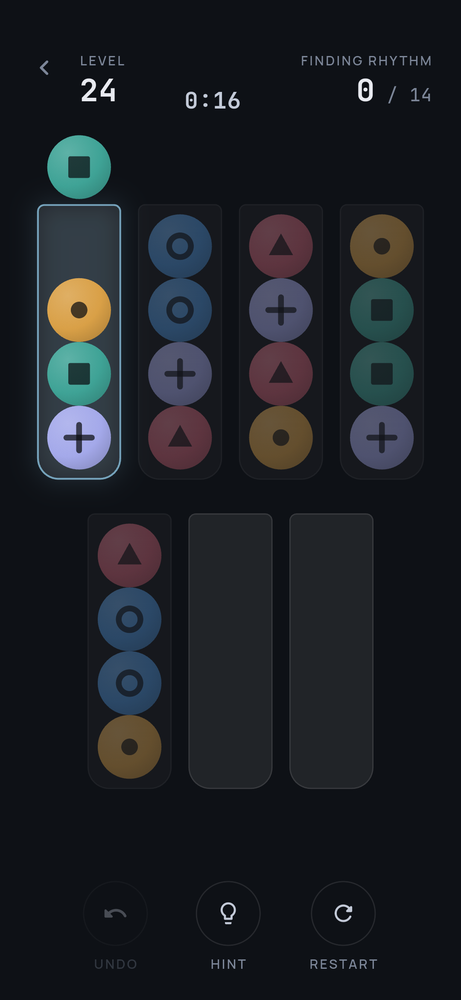
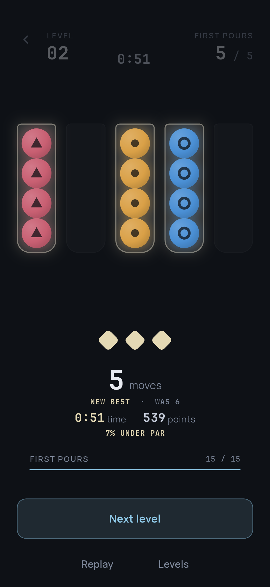
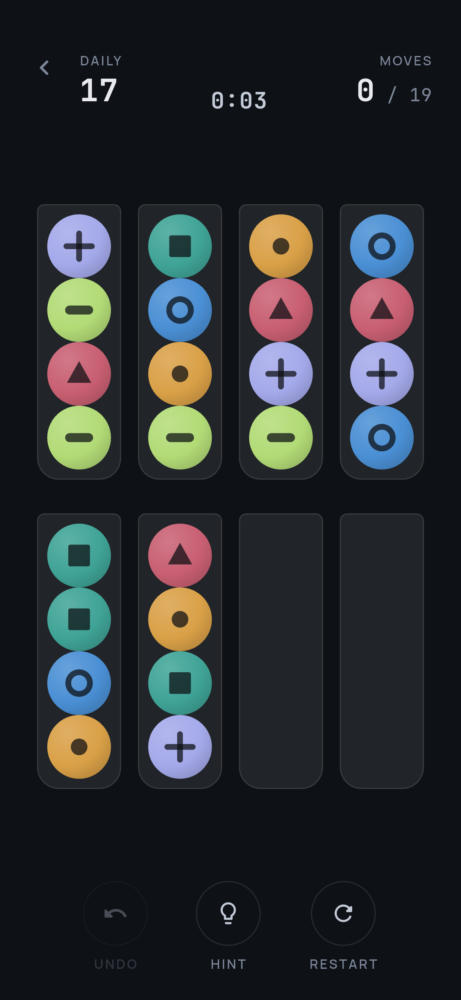
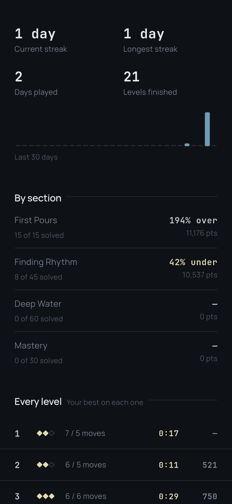
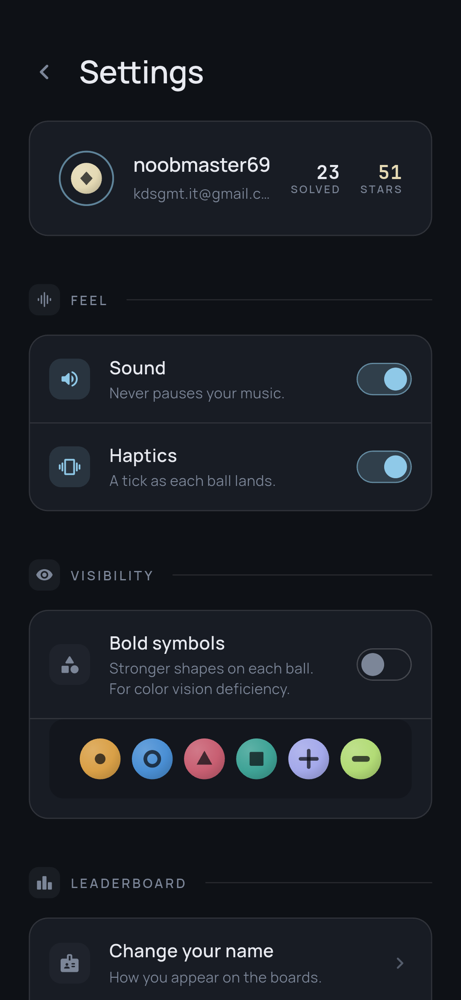
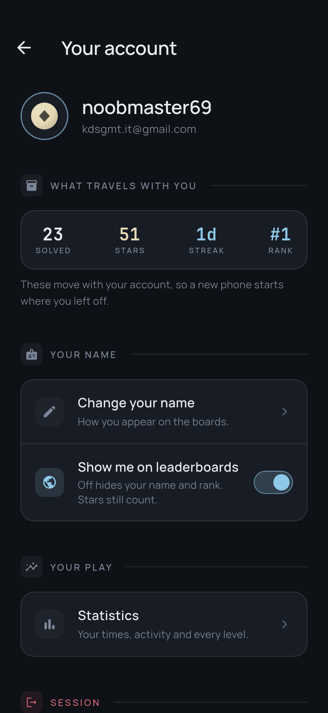
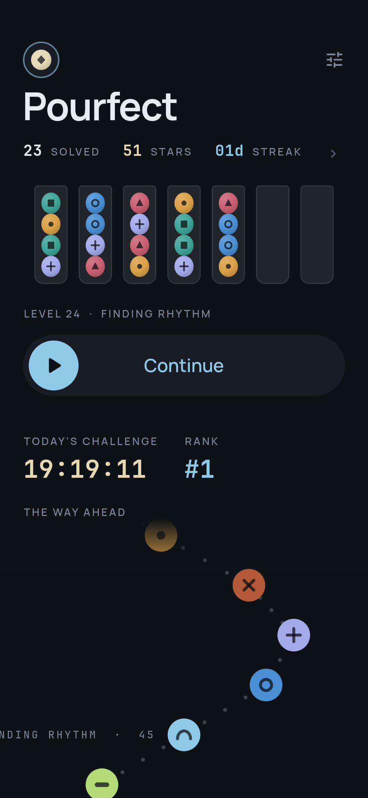

# Pourfect

A calm ball-sort puzzle for Android. Pour the balls between tubes until each
one holds a single color — no timers, no lives, no waiting to play again.

The whole campaign is on the device, so it plays the same offline as on wifi.
The backend is strictly optional enrichment: leaderboards, the daily challenge
and cross-device progress. It lives in a separate private repository and
nothing it does is allowed to block a level from starting.

## Screenshots

| | | |
|---|---|---|
|  |  |  |
| The hub | A board at move 0 | A run held — illegal destinations dim to 40% |
|  |  |  |
| The win moment | Today's challenge | Per-level statistics |
|  |  |  |
| Settings | Your account | The campaign path |

More, including the win choreography mid-flight, in
[`screenshots/`](screenshots/).

## What is actually in here

- **150 levels, every one proven solvable.** The generator is
  random-fill-plus-verify: a board is only kept once the solver has finished it.
  With a single empty tube roughly 99% of random deals are unsolvable, which is
  the whole argument for verifying rather than trusting.
- **`minMoves` is proven, not estimated.** The solver returns optimal paths, so
  par drives both the star rating and the server's anti-cheat floor. Optimality
  is pinned by a test comparing against an independent BFS oracle.
- **Unlimited free undo.** It is a retention feature and never a monetization
  lever. Same for hints being available at all, and for there being no star gate
  between levels.
- **Color *and* shape on every ball, always both** — not a mode buried in a
  menu. Ten simultaneous colors is a hard ceiling (`kMaxColors`), set by what
  stays tellable apart at ball size rather than by what the solver can handle.
- **Every sound is synthesised at startup.** Zero audio assets. The pour rises
  in pitch as the destination tube fills, because a filling vessel shortens its
  air column.
- **It mixes with your music.** No audio focus is requested, so nothing you were
  already listening to gets interrupted.

## Building it

```bash
flutter pub get
flutter run                                   # debug, on a connected device
flutter build apk --release --split-per-abi    # measure per-ABI, never universal
```

The release build needs `android/key.properties` pointing at the upload
keystore, which is not in this repository. Without it Gradle falls back to debug
keys with a loud warning — a fresh clone still builds, it just cannot be
uploaded to Play.

Firebase config (`google-services.json`, `firebase_options.dart`) and `.env` are
likewise not committed. See the secrets section of `CLAUDE.md` for which of
those are genuinely secret and which are merely untracked.

## Working on it

```bash
dart test test/engine                  # pure Dart, no device; ~8 min
flutter test test/state test/ui        # everything that needs a binding
dart run tool/check_layering.dart      # before every commit
dart run tool/validate_levels.dart     # before every release
dart analyze lib test tool
```

Three rules the tooling enforces, because each has already been broken once:

- **`engine/` is pure Dart.** No Flutter, no Riverpod, no `dart:ui`. `ui/` may
  import engine value types but never engine logic — game decisions belong in
  `state/`, where they are testable without pumping a widget tree.
  `tool/check_layering.dart` checks both directions and exits non-zero.
- **US English.** "color", never "colour", in strings, identifiers and comments
  alike. Organic search is the only acquisition channel this game has and the
  American spelling carries materially more of it.
- **Level generation is deterministic.** `tool/generate_levels.dart` with
  default flags must reproduce `assets/levels/levels.bin` byte for byte, and a
  test fails if it does not. Progress is keyed on level id and `minMoves` feeds
  the server's anti-cheat floor, so a silent reshuffle would repoint every saved
  star at a board the player never saw.

`CLAUDE.md` is the long version — the reasoning behind the level curve, the
audio session, the win choreography, the account model and everything that was
tried and reverted. It is worth reading before changing any of them.

## Status

Pre-launch. Flutter 3.47.1, Dart 3.13.1, `com.pranta.pourfect`, version
`1.0.0+1`. Android only for now; iOS needs Sign in with Apple before it can be
submitted, since Apple requires it alongside any other social login.
